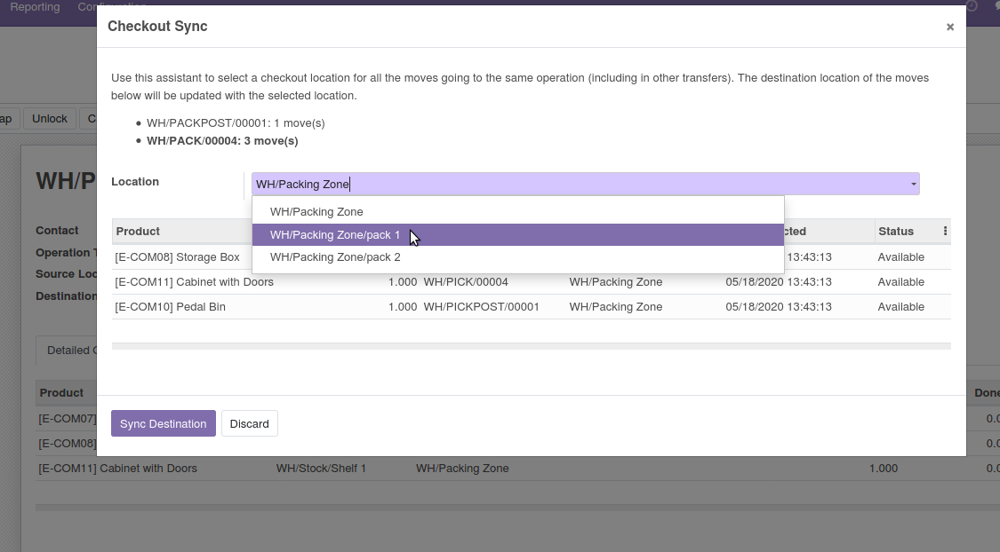

Regroup moves at the same location when they reach an operation type.

Example of use case:

* We use several operation types for Picking Transfers (Pick Shelves, Pick Reserve)
* We use several operation types for Packing (Pack, Pack Post)
* The "Checkout Synchronization" flag is activated on the 2 Packing operation types
* The Packing can occur in several areas (Packing/PACK1, Packing/PACK2, Packing/PACK3)

Based on these assumptions, we have these pickings, all for the same order:

* SHELF001, pick 2 goods in the shelves
* RESER001, pick 2 goods in the reserve
* PACK001, pack 3 of the goods (2 from SHELF001, 1 from RESER001)
* PPOST001, pack the remaining good of the reserve

The operator uses the button "Checkout Sync" on a pick transfer,
for instance SHELF001, and select Packing/PACK2 as destination.
We want all the lines that reach PACK001 to be updated with:

* The move lines (except the one that goes to PPOST001) must now reach
  Packing/PACK2
* The same moves' destination must reach Packing/PACK2 as well:
  we constrain the user to move the goods there as we want to move
  all the goods at the same place for the packing.
* As the moves' destinations are updated to the same packing location,
  new move lines will have the correct destination as well

Notes:

Works best when used with ``stock_available_to_promise_release``:

* When using the mentioned module, we assume that we release moves (which
  creates the whole chain of moves) only when we know that we have the
  quantities in stock (otherwise the module splits the delivery). Any exception
  (which is now rare when you release this ways) that would lead to a backorder
  is handled by canceling the remaining line.
* When the module is not used, then the destination of the backorders may be
  changed at the same time

Compatible with ``stock_dynamic_routing``.
