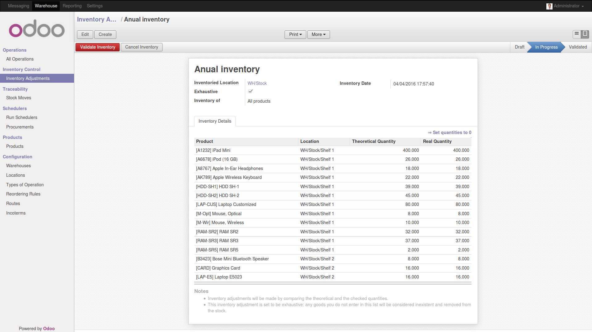
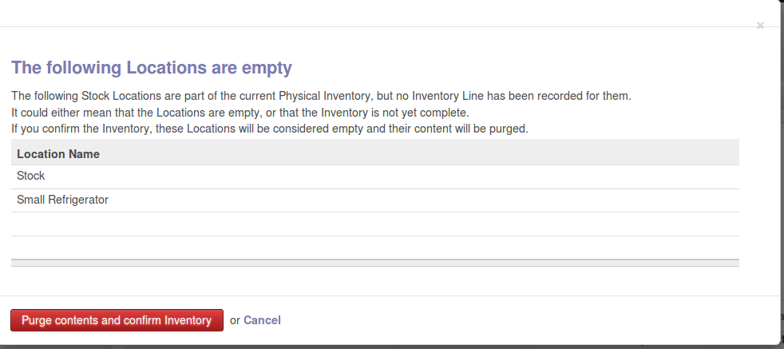

.. image:: https://img.shields.io/badge/licence-AGPL--3-blue.svg
   :target: http://www.gnu.org/licenses/agpl-3.0-standalone.html
   :alt: License: AGPL-3

=============================
Ensure exhaustive Inventories
=============================

Standard Inventory adjustments in Odoo only contain a generic list of
products by locations, which is well suited to partial inventories and simple
warehouses. When a standard inventory is validated, only the products entered
in the list are checked. If a product is present in the computed stock and
not in the recorded inventory, Odoo normally considers that it remains
unchanged.

But for exhaustive inventories in complex warehouses, it is not practical:

* you must make sure all the locations you want have been counted
* you must make sure no other location has been counted by mistake
* you want the computed stock to perfectly match the inventory when you
  validate it.

Usage
=====

This module lets choose whether an Inventory adjustment is exhaustive or
standard.
If you make an exhaustive inventory, the filter is obviously set to "All products".

If the location or some of it's children have not been entered in any of the
lines of an exhaustive inventory, Odoo will warn you when you validate the
Inventory.

Every good that is not in any of the lines of an exhaustive inventory is
considered lost, and gets removed from the stock when you validate the
Inventory.

.. image:: https://odoo-community.org/website/image/ir.attachment/5784_f2813bd/datas
   :alt: Try me on Runbot
   :target: https://runbot.odoo-community.org/runbot/153/8.0

Bug Tracker
===========

Bugs are tracked on `GitHub Issues
<https://github.com/OCA/stock-logistics-warehouse/issues>`_. In case of trouble, please
check there if your issue has already been reported. If you spotted it first,
help us smashing it by providing a detailed and welcomed `feedback
<https://github.com/OCA/
stock-logistics-warehouse/issues/new?body=module:%20
stock_available_sale%0Aversion:%20
8.0%0A%0A**Steps%20to%20reproduce**%0A-%20...%0A%0A**Current%20behavior**%0A%0A**Expected%20behavior**>`_.

Credits
=======

Contributors
------------

* Loïc Bellier (Numérigraphe) <lb@numerigraphe.com>
* Lionel Sausin (Numérigraphe) <ls@numerigraphe.com>
* Laetitia Gangloff (Acsone) <laetitia.gangloff@acsone.eu>

Maintainer
----------

.. image:: https://odoo-community.org/logo.png
   :alt: Odoo Community Association
   :target: https://odoo-community.org

This module is maintained by the OCA.

OCA, or the Odoo Community Association, is a nonprofit organization whose
mission is to support the collaborative development of Odoo features and
promote its widespread use.

To contribute to this module, please visit https://odoo-community.org.
