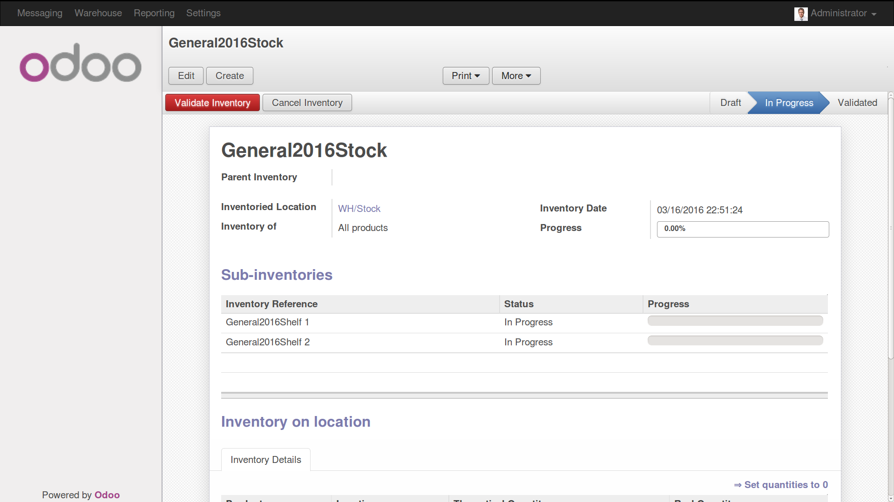
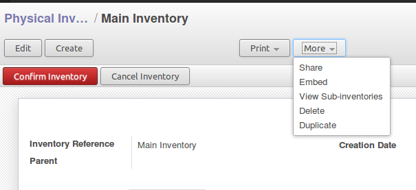

.. image:: https://img.shields.io/badge/licence-AGPL--3-blue.svg
   :target: http://www.gnu.org/licenses/agpl-3.0-standalone.html
   :alt: License: AGPL-3

================================================
Hierarchical structure for Inventory adjustments
================================================

This module adds a parent-child relationship between inventory adjustments, to
help users manage complex warehouses.
Using several inventories, you can distribute the counting to several persons
and still keep a clear overview of global inventory's status.

The main inventory will be for a general Location, and the sub-inventories
should contain sub-locations.

Configuration
=============
This module is only useful if you use several stock locations.

Usage
=====

.. image:: https://odoo-community.org/website/image/ir.attachment/5784_f2813bd/datas
   :alt: Try me on Runbot
   :target: https://runbot.odoo-community.org/runbot/153/8.0
   
Generating the inventories
--------------------------

The most convenient way to create a complete hierarchy of inventories is the
wizard available in the menu:

1. Warehouse
#. Inventory Control
#. Generate Inventory

If that doesn't fit your warehouse, you can also create the inventories
manually, simply indicating the parent for each one before you start them.

Processing the inventories
--------------------------

Odoo will make sure the status of the inventory and it's sub-inventories are
consistent.

Preparing the main inventory will automatically prepare the sub-inventories.
All the sub-inventories will have the same date as the main inventory.

You must validate the sub-inventories first, beginning with the "deepest" ones
in the hierarchy, before you can validate the main inventories.

Canceling the main inventory will automatically cancel all the
sub-inventories. However, sub-inventories can still be canceled even if their
parents are not canceled first. This lets you make corrections to the
sub-inventories before the main inventory is validated.  

Watching progress and navigating
--------------------------------

A progress bar on the main inventories helps you check the global advancement.

Sub-inventories are shown on the main inventories form, and they can be
manipulated from the popup windows.

They can also be opened in dedicated list or form view using the menu
"More > View sub-inventories" from the main inventory's form. 

   
Known issues
============
The inventory generation wizard cannot produce hierarchies based on the
stock owners, the companies, the warehouses, etc.

It also always produces inventories with the default filter (usually
"All products"). However, you can change this filter before you start each
inventory.

Bug Tracker
===========

Bugs are tracked on `GitHub Issues
<https://github.com/OCA/stock-logistics-warehouse/issues>`_. In case of trouble, please
check there if your issue has already been reported. If you spotted it first,
help us smashing it by providing a detailed and welcomed `feedback
<https://github.com/OCA/
stock-logistics-warehouse/issues/new?body=module:%20
stock_available_sale%0Aversion:%20
8.0%0A%0A**Steps%20to%20reproduce**%0A-%20...%0A%0A**Current%20behavior**%0A%0A**Expected%20behavior**>`_.

Credits
=======

Contributors
------------

* Loïc Bellier (Numérigraphe) <lb@numerigraphe.com>
* Lionel Sausin (Numérigraphe) <ls@numerigraphe.com>
* Laetitia Gangloff (Acsone) <laetitia.gangloff@acsone.eu>

Maintainer
----------

.. image:: https://odoo-community.org/logo.png
   :alt: Odoo Community Association
   :target: https://odoo-community.org

This module is maintained by the OCA.

OCA, or the Odoo Community Association, is a nonprofit organization whose
mission is to support the collaborative development of Odoo features and
promote its widespread use.

To contribute to this module, please visit https://odoo-community.org.
