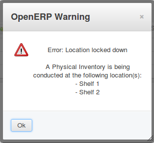

.. image:: https://img.shields.io/badge/licence-AGPL--3-blue.svg
   :target: http://www.gnu.org/licenses/agpl-3.0-standalone.html
   :alt: License: AGPL-3

======================================
Lock down locations during inventories
======================================
This module lets you lock down the locations during an inventory.

Usage
=====

While an inventory is in the state "In progress", no stock moves
can be recorded in/out of the inventory's location: users will get an error
message.
Creating or modifying locations is also forbidden.

.. image:: https://odoo-community.org/website/image/ir.attachment/5784_f2813bd/datas
   :alt: Try me on Runbot
   :target: https://runbot.odoo-community.org/runbot/153/9.0

Bug Tracker
===========

Bugs are tracked on `GitHub Issues
<https://github.com/OCA/stock-logistics-warehouse/issues>`_. In case of trouble, please
check there if your issue has already been reported. If you spotted it first,
help us smashing it by providing a detailed and welcomed feedback.

Credits
=======

Contributors
------------

* Loïc Bellier (Numérigraphe) <lb@numerigraphe.com>
* Lionel Sausin (Numérigraphe) <ls@numerigraphe.com>
* Laetitia Gangloff (Acsone) <laetitia.gangloff@acsone.eu>
* Laurent Mignon (Acsone) <laurent.mignon@acsone.eu>
* Lois Rilo (Eficent) <lois.rilo@eficent.com>
* Jordi Ballester (Eficent) <jordi.ballester@eficent.com>

Maintainer
----------

.. image:: https://odoo-community.org/logo.png
   :alt: Odoo Community Association
   :target: https://odoo-community.org

This module is maintained by the OCA.

OCA, or the Odoo Community Association, is a nonprofit organization whose
mission is to support the collaborative development of Odoo features and
promote its widespread use.

To contribute to this module, please visit https://odoo-community.org.
