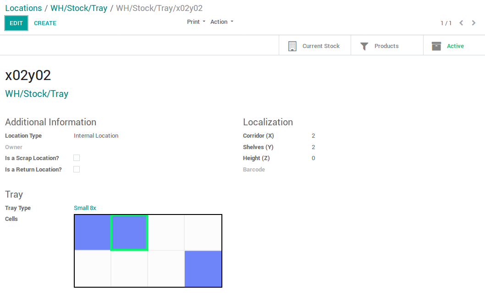

Add an optional Tray Type on Stock Locations.
A tray type defines a number of columns and rows.
A location with a tray type becomes a tray, and sub-locations are automatically
created according to the columns and rows of the tray type

