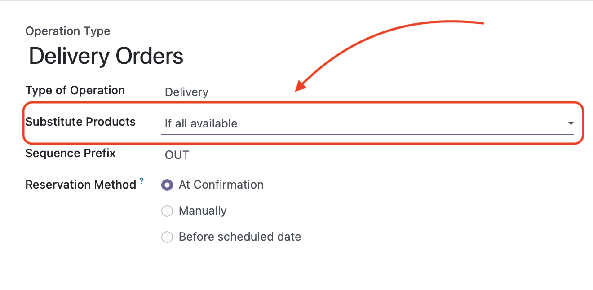
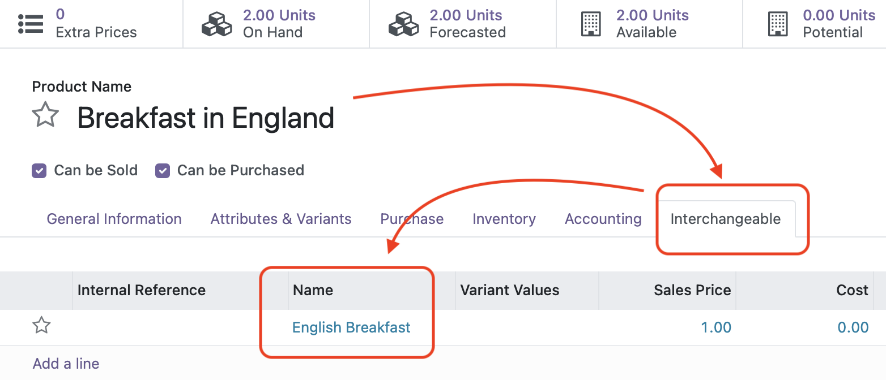

Open **Inventory** -> **Configuration** -> **Operations types** and select an Operation Type you would like to use interchangeable products in.
**NB:** Only Operation Types of the **Delivery** type can use this feature.

Select **Substitute Products** mode:

- "If all available". Interchangeable products will be added products will be added only if it is possible to reserve all requested amount.
- "If any available". Interchangeable products will be added if there is at least a single one available.

**Product Settings**

In Product form open  **Interchangeable** tab and add products that can be used as a substitute.

**Important**: if you are using product variants Interchangeable products must be defined for each variant separately.

