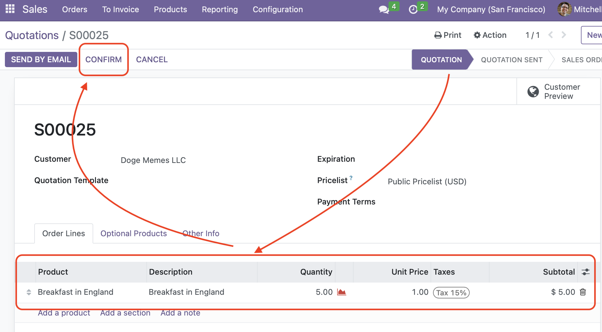
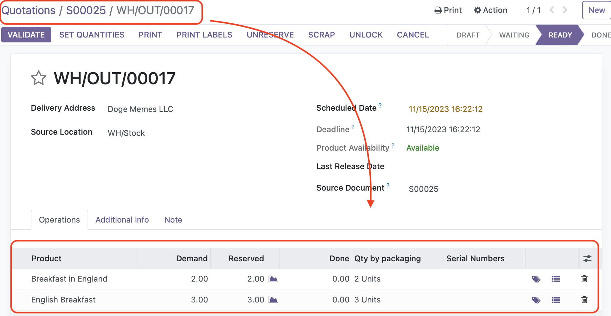

- Create a new quotation with some interchangeable product(s) in it

- Confirm the quotation
- If there is not enough stock of the product available its substitute will be added to complete the delivery order

