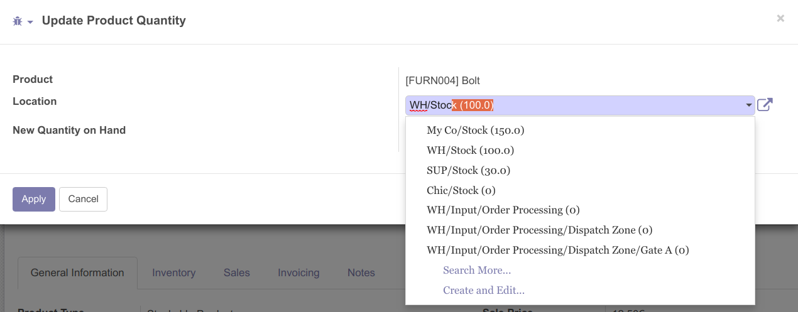

.. image:: https://img.shields.io/badge/licence-AGPL--3-blue.svg
   :target: http://www.gnu.org/licenses/agpl-3.0-standalone.html
   :alt: License: AGPL-3

=========================================
Stock Product Location Sorted by Quantity
=========================================

This module allows in the update wizard of quantities for a product, to sort the stock location by quantity.

.. image:: stock_product_location_sorted_by_qty/static/description/stock_product_location_sorted_by_qty.png
    :width: 800 px
    :alt: Product Location Sorted by Quantity

|

Bug Tracker
===========

Bugs are tracked on `GitHub Issues
<https://github.com/OCA/stock-logistics-warehouse/issues>`_. In case of trouble, please
check there if your issue has already been reported. If you spotted it first,
help us smash it by providing detailed and welcomed feedback.

Credits
=======

Contributors
------------

* Chafique Delli <chafique.delli@akretion.com>

Maintainer
----------

.. image:: https://odoo-community.org/logo.png
   :alt: Odoo Community Association
   :target: https://odoo-community.org
   
This module is maintained by the OCA.

OCA, or the Odoo Community Association, is a nonprofit organization whose mission is to support the collaborative development of Odoo features and promote its widespread use.

To contribute to this module, please visit https://odoo-community.org.
