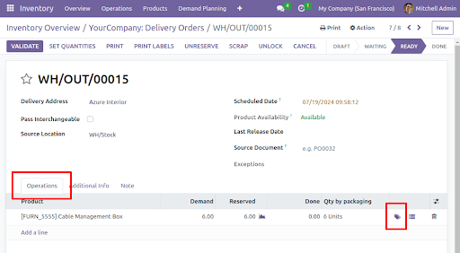
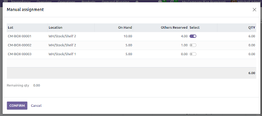
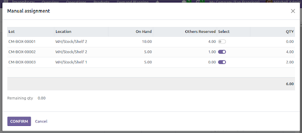
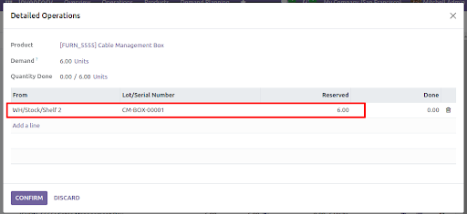

Once a planned transfer has been confirmed (manually, or with the confirmation of a sales order, for example), in order to validate it, it is first necessary to perform the "check availability" action. By selecting "check availability", Odoo automatically checks the quantities in stock necessary to cover the picking demand and reserves the products to prevent them from being used in other movements.

In order to manually select the quant we want to assign to the transfer, we have to:
1. Click on the label icon at the end of each move as shown below.

This will show us a wizard like the following:

In the form we can see the following information:
* Lot: The lot/serial number of the products we have on hand. If the selected product does not have traceability, it will appear empty.
* Location: Shows the current location in which the product is in stock.
* On Hand: Quantity on hand in each location and the corresponding lot/serial numbers.
* Other Reserved: Quantity already reserved for another picking.
* Select: If checked, it allows us to indicate that we are going to reserve products from that specific lot and location.
* Qty: Quantity to be reserved for the current picking.
* Remaining qty (located at the bottom left): Indicates the quantity that could not be reserved due to a lack of available stock.

2. Modify the quantity column and check the Select column, in order to define the locations and lot/serial numbers that we need to transfer.

3. Click the confirm button in the wizard. With that, the reserved quantity will be set/changed to follow the manual assignment. It can be checked in the detailed operations of the movement.

